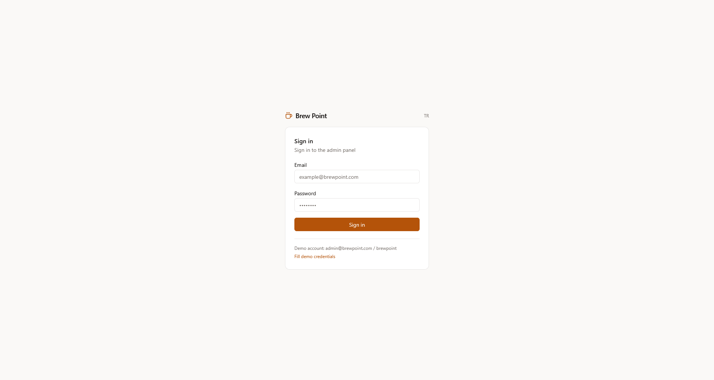
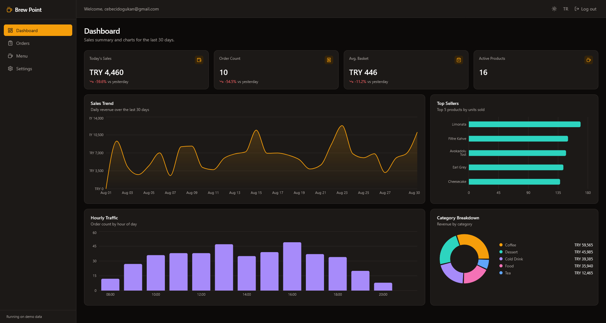
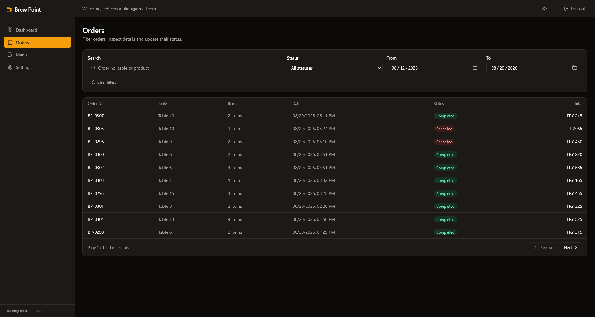
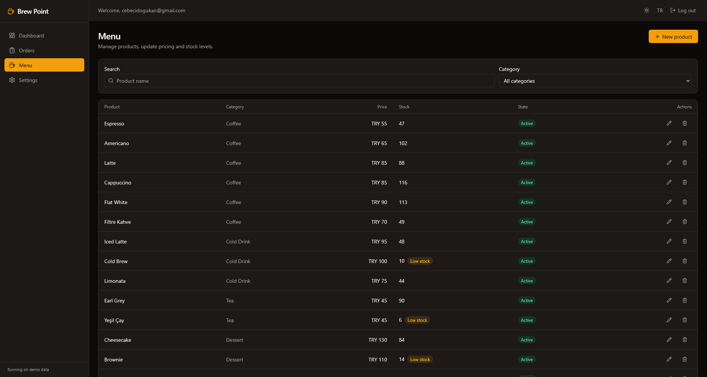
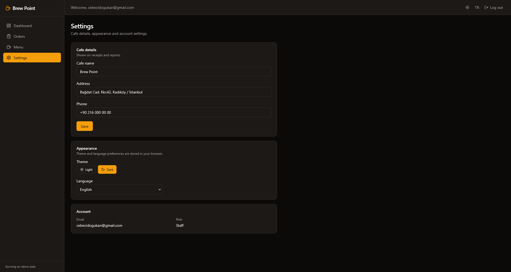

# ☕ Brew Point

[Türkçe](#türkçe) | [English](#english)

---

## Türkçe

Kurgusal bir kafe için sipariş, menü ve satış analizi yönetim paneli. React 19 +
TypeScript ile yazılmış bir portfolyo projesi.

> ⚠️ **Şu an sadece frontend.** Backend'e bağlı değil — tüm veri tarayıcıda,
> bellek içi sahte bir veritabanından geliyor (`src/lib/mock-db.ts`). Sayfayı
> yenilersen değişiklikler sıfırlanır. Servis katmanının imzaları gerçek bir
> Spring Boot API'siyle birebir uyumlu tasarlandı — aşağıdaki
> [Backend'e Geçiş](#backend'e-geçiş) bölümüne bakabilirsin.

### Ekran Görüntüleri

| Giriş | Dashboard |
| --- | --- |
|  |  |

| Siparişler | Menü |
| --- | --- |
|  |  |

| Ayarlar |
| --- |
|  |

### Özellikler

- **Dashboard** — 4 KPI kartı (düne göre yüzde değişimle), satış trendi (30 gün),
  en çok satan ürünler, saatlik yoğunluk ve kategori bazlı ciro grafikleri
- **Siparişler** — sunucu şeklinde sayfalama, durum/tarih filtresi, arama,
  sipariş detay modalı ve durum güncelleme
- **Menü** — ürün CRUD, kategori filtresi, düşük stok rozeti, form validasyonu
- **Ayarlar** — kafe bilgileri, tema ve dil tercihi, hesap özeti
- **i18n** — TR/EN, tercih `localStorage`'da saklanır; para/tarih formatları
  `Intl` ile dile göre değişir
- **Tema** — açık/koyu mod, semantik CSS token'ları üzerinden
- **Responsive** — mobilde sidebar drawer, yatay kaydırılabilir tablolar
- Route bazlı code splitting, loading skeleton'ları, toast bildirimleri

### Tech Stack

| Alan | Kütüphane |
| --- | --- |
| UI | React 19, TypeScript, Vite |
| Stil | Tailwind CSS v4 (`@tailwindcss/vite`) |
| Server state | TanStack Query |
| Client state | Zustand (persist) |
| Routing | React Router v7 |
| Form | React Hook Form + Zod |
| Grafik | Recharts |
| HTTP | Axios (interceptor'lı instance, backend bağlandığında devreye girecek) |
| i18n | i18next + react-i18next |
| İkon | lucide-react |
| Lint | oxlint |

### Kurulum

```bash
npm install
npm run dev
```

`http://localhost:5173` adresinde açılır.

Demo giriş: **admin@brewpoint.com / brewpoint**
(`admin` ile başlayan e-postalar ADMIN, diğerleri STAFF rolüyle giriş yapar.)

#### Komutlar

| Komut | Açıklama |
| --- | --- |
| `npm run dev` | Geliştirme sunucusu |
| `npm run build` | Tip kontrolü + production build |
| `npm run preview` | Build çıktısını önizle |
| `npm run lint` | oxlint |

### Klasör Yapısı

```
src/
├─ components/
│  ├─ ui/          # Button, Card, Field, Modal, Toaster... (tasarım primitifleri)
│  ├─ layout/      # AppLayout, Sidebar, Navbar
│  ├─ dashboard/   # KPI kartı ve Recharts grafikleri
│  ├─ orders/      # Sipariş detay modalı
│  └─ products/    # Ürün formu, silme onayı
├─ pages/          # Login, Dashboard, Orders, Products, Settings
├─ hooks/          # TanStack Query hook'ları, formatlayıcılar, tema, debounce
├─ lib/
│  ├─ api/         # Servis katmanı (şu an mock, backend'e hazır)
│  ├─ mock-db.ts   # Bellek içi sahte veritabanı
│  ├─ axios.ts     # JWT interceptor'lı axios instance
│  └─ format.ts    # Intl tabanlı para/tarih/sayı formatları
├─ store/          # Zustand: auth, ui (tema/drawer), toast
├─ types/          # Domain tipleri (Order, Product, Page<T>...)
└─ i18n/           # i18next config + tr/en çevirileri
```

### Backend'e Geçiş

`src/lib/api/*.ts` içindeki her fonksiyonun başında hedef endpoint çağrısı
yorum olarak duruyor. Backend hazır olduğunda mock gövdeyi silip yorumdaki
satırı açmak yeterli — tipler ve `Page<T>` şekli Spring Boot'un pagination
yanıtıyla uyumlu tasarlandı.

İlerleme durumu ve yol haritası için [PROGRESS.md](PROGRESS.md).

[↑ Dile göre git](#brew-point)

---

## English

An admin panel for a fictional cafe — orders, menu, and sales analytics. A
portfolio project built with React 19 + TypeScript.

> ⚠️ **Frontend only, for now.** No backend is connected yet — all data comes
> from an in-memory mock database in the browser (`src/lib/mock-db.ts`).
> Refreshing the page resets any changes. The service layer's function
> signatures are designed to match a real Spring Boot API 1:1 — see
> [Swapping in a Backend](#swapping-in-a-backend) below.

### Screenshots

| Sign in | Dashboard |
| --- | --- |
|  |  |

| Orders | Menu |
| --- | --- |
|  |  |

| Settings |
| --- |
|  |

### Features

- **Dashboard** — 4 KPI cards (with % change vs. yesterday), a 30-day sales
  trend, top-selling products, hourly traffic, and revenue-by-category charts
- **Orders** — server-style pagination, status/date filtering, search, an
  order detail modal, and status updates
- **Menu** — full product CRUD, category filtering, a low-stock badge, form
  validation
- **Settings** — cafe details, theme and language preference, account summary
- **i18n** — TR/EN, preference stored in `localStorage`; currency/date
  formatting adapts to the active language via `Intl`
- **Theming** — light/dark mode driven by semantic CSS tokens
- **Responsive** — a sidebar drawer on mobile, horizontally scrollable tables
- Route-based code splitting, loading skeletons, toast notifications

### Tech Stack

| Area | Library |
| --- | --- |
| UI | React 19, TypeScript, Vite |
| Styling | Tailwind CSS v4 (`@tailwindcss/vite`) |
| Server state | TanStack Query |
| Client state | Zustand (persisted) |
| Routing | React Router v7 |
| Forms | React Hook Form + Zod |
| Charts | Recharts |
| HTTP | Axios (instance with interceptors, ready for when the backend lands) |
| i18n | i18next + react-i18next |
| Icons | lucide-react |
| Linting | oxlint |

### Getting Started

```bash
npm install
npm run dev
```

Opens at `http://localhost:5173`.

Demo login: **admin@brewpoint.com / brewpoint**
(emails starting with `admin` sign in as ADMIN, everyone else as STAFF.)

#### Scripts

| Command | Description |
| --- | --- |
| `npm run dev` | Start the dev server |
| `npm run build` | Type-check and build for production |
| `npm run preview` | Preview the production build |
| `npm run lint` | Run oxlint |

### Project Structure

```
src/
├─ components/
│  ├─ ui/          # Button, Card, Field, Modal, Toaster... (design primitives)
│  ├─ layout/      # AppLayout, Sidebar, Navbar
│  ├─ dashboard/   # KPI cards and Recharts charts
│  ├─ orders/      # Order detail modal
│  └─ products/    # Product form, delete confirmation
├─ pages/          # Login, Dashboard, Orders, Products, Settings
├─ hooks/          # TanStack Query hooks, formatters, theme, debounce
├─ lib/
│  ├─ api/         # Service layer (mocked today, backend-ready)
│  ├─ mock-db.ts   # In-memory mock database
│  ├─ axios.ts     # Axios instance with a JWT interceptor
│  └─ format.ts    # Intl-based currency/date/number formatting
├─ store/          # Zustand: auth, ui (theme/drawer), toast
├─ types/          # Domain types (Order, Product, Page<T>...)
└─ i18n/           # i18next config + tr/en translations
```

### Swapping in a Backend

Every function in `src/lib/api/*.ts` has the target endpoint call commented
out right above its mock body. Once the backend is ready, delete the mock
body and uncomment that line — the types and the `Page<T>` shape were
designed to match a Spring Boot pagination response.

See [PROGRESS.md](PROGRESS.md) for current status and roadmap (in Turkish).

[↑ Jump to language links](#brew-point)
